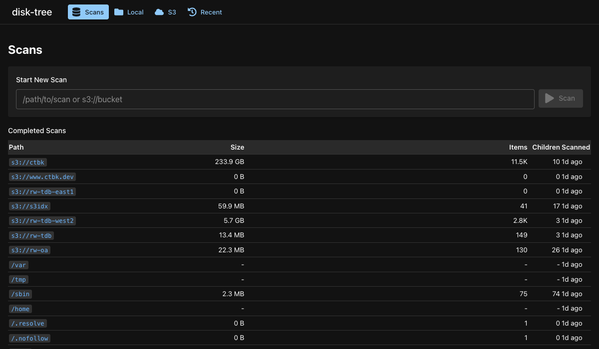
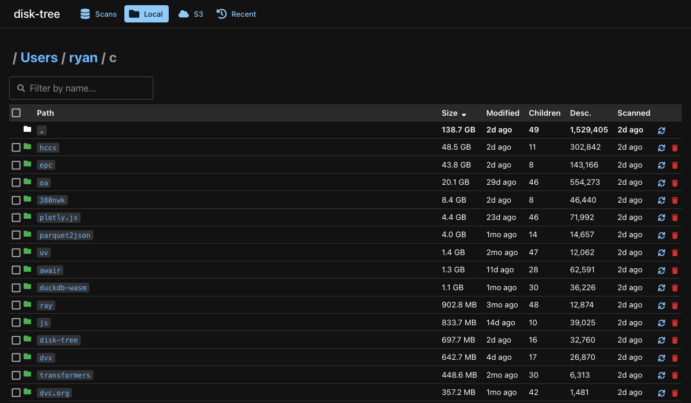
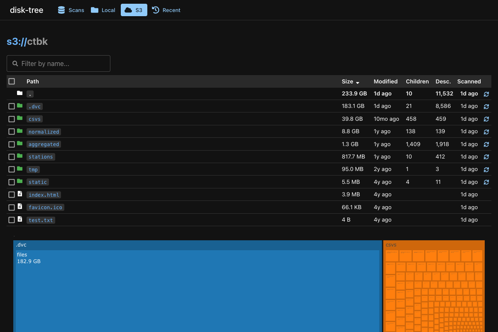
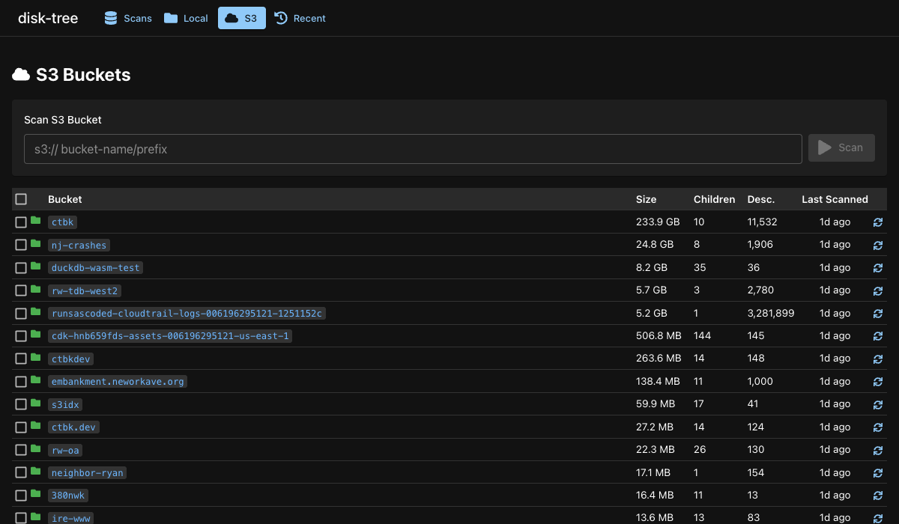

# disk-tree

Disk and cloud storage analyzer with caching, CLI, and web UI.

<!-- toc -->
- [Install](#install)
- [Web UI](#web-ui)
- [CLI](#cli)
  - [Examples](#examples)
- [Notes](#notes)
  - [Caching](#caching)
  - [Performance](#performance)
<!-- /toc -->

## Install

```bash
pip install disk-tree
```

## Web UI

Start the server and open http://localhost:5001:

```bash
disk-tree-server
```

### Scan List

View all cached scans, start new scans for local paths or S3 buckets:



### Directory Browsing

Browse directories with size, modification time, children, and descendant counts. Multi-select with keyboard navigation, bulk delete:



### Treemap Visualization

Interactive treemaps for visualizing space usage:



### S3 Buckets

Browse and scan S3 buckets:



## CLI

```bash
disk-tree index --help
# Usage: disk-tree index [OPTIONS] [URL]
#
# Options:
#   -C, --no-cache-read    Force fresh scan (ignore cache)
#   -g, --gc               Garbage collect old scans
#   -s, --sudo             Run gfind with sudo
#   -m, --measure-memory   Track peak memory usage
#   --help                 Show this message and exit.

disk-tree scans           # List cached scans (JSON)
disk-tree-server          # Start the web UI server
```

### Examples

Scan an S3 bucket:
```bash
disk-tree index s3://ctbk
# 2333 files in 138 dirs, total size 45.1G
#       4B  test.txt
#    66.1K  favicon.ico
#     3.9M  index.html
#     5.5M  static
#    11.2M  .dvc
#    95.0M  tmp
#   579.1M  stations
#     1.2G  aggregated
#     6.0G  normalized
#    37.2G  csvs
```

Scan a local directory:
```bash
disk-tree index /Users/ryan/c/disk-tree
# 97 files in 47 dirs, total size 1.5M
#       0B  disk-tree/__init__.py
#      77B  disk-tree/requirements.txt
#     867B  disk-tree/setup.py
#     2.3K  disk-tree/README.md
#    23.8K  disk-tree/disk_tree
#   291.8K  disk-tree/screenshots
#   580.4K  disk-tree/.git
#   628.6K  disk-tree/www
```

## Notes

### Caching

`disk-tree` caches scan results as Parquet files in `~/.config/disk-tree/scans/`, with metadata in `~/.config/disk-tree/disk-tree.db`. Override with `DISK_TREE_ROOT`.

### Performance

- **Local filesystems**: Uses `gfind -printf` for fast stat collection (handles sparse files correctly with 512-byte block sizes)
- **S3**: Caches `aws s3 ls --recursive` output
- **Fresher child patching**: When viewing a parent directory, newer child scans automatically patch in updated stats
- **Depth-based predicate pushdown**: Parquet queries filter by depth for fast loading

## Development

```bash
# Python
uv sync
disk-tree-server

# Web UI
cd ui
pnpm install
pnpm dev  # http://localhost:5180 (proxies API to :5001)

# Screenshots
cd ui
pnpm screenshots
```
