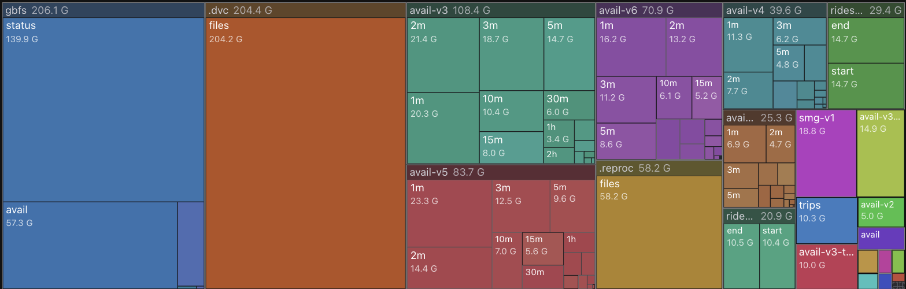

# disk-tree

Disk and cloud storage analyzer: a scanning/indexing CLI for local filesystems and S3 / R2 / GCS buckets, and a Cloudflare-hosted treemap site (`site/`) over its indexes.

[](https://r2.rbw.sh/r2/ctbk)

<p align="center"><b><a href="https://r2.rbw.sh/r2/ctbk">▶ Live demo</a></b> — interactive treemap of a 916&nbsp;GB R2 bucket (drill in, filter, compare), from <a href="https://ctbk.dev">ctbk.dev</a></p>

<!-- toc -->
- [Install](#install)
- [Site](#site)
- [CLI](#cli)
  - [Examples](#examples)
- [Notes](#notes)
  - [Caching](#caching)
  - [Performance](#performance)
<!-- /toc -->

## Install

From a clone (one uv workspace: the engine plus the `dt-cloud` overlay in `cloud/`):

```bash
uv sync                                     # engine (`disk-tree` CLI)
uv sync --all-packages --all-extras         # + dt-cloud, every extra
```

## Site

`site/` is a Vite + React app with Cloudflare Pages Functions over a path index of each scan (in R2 / GCS, with D1 for the index footers): treemaps you can drill into, filter, diff between scans, and an age lens. Zero-dependency DIY-SVG/canvas ([`@rdub/treemap`](packages/treemap)), no chart lib. Try it on the [live `r2://ctbk` demo](https://r2.rbw.sh/r2/ctbk).

## CLI

```bash
disk-tree index --help
# Usage: disk-tree index [OPTIONS] [URL]
#
# Options:
#   -C, --no-cache-read    Force fresh scan (ignore cache)
#   -g, --gc               Garbage collect old scans
#   -s, --sudo             Run gfind with sudo
#   -m, --measure-memory   Track peak memory usage
#   --help                 Show this message and exit.

disk-tree scans           # List cached scans (JSON)
```

`gcs://` buckets have no live lister: list one with `disk-tree bulk-list`, then `disk-tree import -l <listing>`.

### Examples

Scan an S3 bucket:
```bash
disk-tree index s3://ctbk
# 2333 files in 138 dirs, total size 45.1G
#       4B  test.txt
#    66.1K  favicon.ico
#     3.9M  index.html
#     5.5M  static
#    11.2M  .dvc
#    95.0M  tmp
#   579.1M  stations
#     1.2G  aggregated
#     6.0G  normalized
#    37.2G  csvs
```

Scan a local directory:
```bash
disk-tree index /Users/ryan/c/disk-tree
# 97 files in 47 dirs, total size 1.5M
#       0B  disk-tree/__init__.py
#      77B  disk-tree/requirements.txt
#     867B  disk-tree/setup.py
#     2.3K  disk-tree/README.md
#    23.8K  disk-tree/disk_tree
#   291.8K  disk-tree/screenshots
#   580.4K  disk-tree/.git
#   628.6K  disk-tree/www
```

## Notes

### Caching

`disk-tree` caches scan results as Parquet files in `~/.config/disk-tree/scans/`, with metadata in `~/.config/disk-tree/disk-tree.db`. Override with `DISK_TREE_ROOT`.

### Performance

- **Local filesystems**: Uses `gfind -printf` for fast stat collection (handles sparse files correctly with 512-byte block sizes)
- **S3**: Caches `aws s3 ls --recursive` output
- **Depth-based predicate pushdown**: Parquet queries filter by depth for fast loading

## Development

```bash
# Python
uv sync
pytest tests/

# Site
pnpm install
cd site
pnpm dev
```
