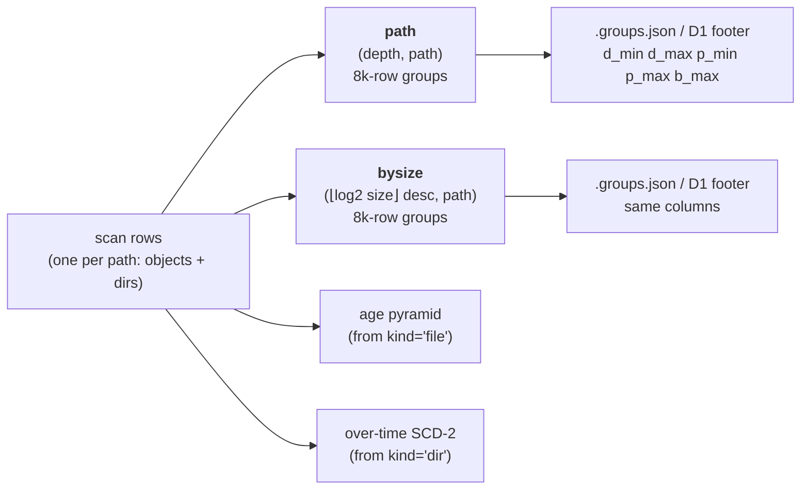

# Unified path store: objects and dirs in one served table

**Status:** draft v2, 2026-09-30. Base work (`cloud`). Origin: Ryan's pushback in the cw-s3 session (12:11, 13:26 UTC) on a proposed "objects tier": *"the simplest mental model, to me, is a unified path store that holds objs and dirs, bc that's what a TM needs: paths by size … what I especially don't want is thresholded queries that will merge independent result sets from objs and dirs"*. v2 (after his review of v1): the store keeps the layer-2's column names; the byte-floor tiers and the per-parent size sort are replaced by one size-bucketed sort (§1.3), which also answers his "denormalized size-desc index per subtree" idea (§1.4); phase 0 runs on Batch.

## 0. Where we are, and why it got here

Every served tier today holds **directory rows only**. `cloud/src/dt_cloud/index.py:85` builds cw's path index `FROM read_parquet(l2) WHERE kind = 'dir'`; gcs's `viz.write_path_index` rolls objects up into `(bucket, dir)` groups and never emits them. Objects exist only in the raw listing (`cw-l2/<scan>/<bucket>.parquet`, `listing/<date>/<bucket>/*.parquet`) and reach the browser only through `/files`. The consequences are the hacks Ryan keeps hitting: the "objects aren't listed yet" note (`App.tsx:1051`), the `o ≤ 1 → pin instead of drill` rule (`Treemap.tsx:605`), children-table rows that aren't links (`ChildrenTable.tsx:229`), `DiffRow.k` hard-coded to `'dir'` (`view.ts:742`), a diff that can't say which object was added.

It got here by descent, not decision. The served index is mgu's August 2026 gcs rollup, built to fit a 613M-object fleet into something a Worker could range-read; dropping objects was the shortcut that made it fit. DT's own layer-2 listing has always had file rows (`aggregate_duckdb.py`, `kind` on every row, sorted `(depth, path)`), and the DT demo's `ui/functions/api/scan.ts` reads it directly, objects included. When the site moved onto the DT base, the *writer* was ported and the L2 was kept alongside as an archive; each later feature (coarse tiers, age pyramid, over-time, diff) was built on the dir-only rows and added its own leaf special-case. Nobody reconciled the two because the raw listing "held" the objects and `/files` was the escape hatch.

The cw L2 is, in fact, already ~90% of the unified store: 54.2M rows, objects and dirs, `(depth, path)` sort, per-row `size`/`mtime`/`kind`/`n_children`. The gap is 64K-row groups instead of 8k with a D1 footer, three columns (`usr`, `a`, class bytes) that cw doesn't use anyway, and readers that never open it. The design below makes that file *the* served index, so there is one artifact instead of two.

## 1. The store

One table per scan: **one row per path**, object or directory. There is no objects tier and no dirs tier; a tier is a *filter* or a *sort* of these rows, never a different table.

### 1.1 Columns — the layer-2's, by their layer-2 names

| col | type | object row | dir row | notes |
|---|---|---|---|---|
| `path` | string | bucket-prefixed key | bucket-prefixed prefix, no trailing `/` | depth 1 = bucket; depth 0 = fleet root `''` |
| `depth` | int16 | | | segments in `path` |
| `kind` | `'file'` \| `'dir'` | | | dictionary-encoded; for the renderer (leaf vs branch) and the executor (key vs prefix), never for interpreting a value |
| `size` | int64 | own size | Σ descendant object bytes | monoid `+` |
| `n_files` | int64 | `1` | descendant objects | monoid `+` (the API's `o`) |
| `n_children` | int32 | `0` | direct children, objects + dirs | what `(other).f` and the flat-parent rule need |
| `n_desc` | int64 | `0` | all descendants | as today's L2 |
| `mtime` | int64 | native primary stamp | max over descendants | monoid `max`; epoch seconds |
| `mtime_mean` | double | own | Σ size·mtime / size | the age lens's mean (`-m`); monoid via `Σ size·mtime` |
| `created` | int64 \| null | native, where the platform has it | max over descendants | GCS only; S3/R2 null (RLE, free) |
| `usr` | string \| null | owner (attribution) | owner slice; one row per `(path, usr)` as today | null = unclaimed; gcs only |
| `last_read` | int32 \| null | last-read day | max over descendants | gcs access log (the API's `a`) |
| `sum_storage_class_id_<k>` | int64 | `size` or 0 | Σ per class | the L2's pivots; an implied one is dropped per listing-slim |
| `size_hist_n` | list<int32> \| null | null | descendant sizes, whole-log2 bins, counts | monoid vector `+` (mgu-scale-unification item E); §2.3 |

**No short names.** `b`, `o`, `wts`, `wb`, `a` came from the *JSON wire format* (`/api/subtree` repeats every field name per node, so short keys save bytes there, even after gzip); in parquet a column name is stored once in the footer and buys nothing. The store keeps the L2's names, the API keeps its wire names, and the reader maps at the edge — as it already maps `wts/wb` → `d`.

Rules that make this *one* table rather than two glued together:

- **Every column is defined for both kinds, with the same meaning.** `size` is "bytes at or under this path"; for an object that's its size. `mtime` is "latest stamp at or under this path"; for an object that's its own. `n_children`/`size_hist_n` are "direct children" / "descendant sizes"; for an object those are `0` / null. Nothing is a different shape per kind, so a reader never branches on `kind` to interpret a value.
- **Dir mtime is one scalar.** Ryan's worry was that a per-dir *distribution* would be a different shape from an object's scalar and so "should arguably be a different col". It is: the distribution is the **age pyramid tier**, keyed by path, exactly as today (`(path, depth, binstart, b, o)`). The row itself carries the two monoidal scalars every platform can produce (`max`, size-weighted mean), which are what the treemap's age lens and the children table use.
- **Native stamps are kept verbatim, per platform.** S3/R2 has only `LastModified` (upload time) → `mtime`, `created` null. GCS has `timeCreated` and `updated` → `created` and `mtime` (objects are immutable, so these differ only on metadata rewrites; today's gcs index uses `created`, and `created` keeps that available). The store's config says which stamp `mtime` is (`mtime: last_modified | updated`), so the FE's "age" label is honest per store. We never store a synthesized stamp in place of a native one; that is the one thing that couldn't be undone.
- **Rollup columns on object rows cost nothing.** `n_children=0`, `size_hist_n=null`, `created=null` on 46M consecutive-ish rows RLE to bytes. Serving cost is column projection: a treemap read projects `path, depth, kind, size, n_files, mtime_mean` and never decodes the histogram, `usr`, or the class columns; parquet column chunks are independent, so unread columns are not fetched, let alone decompressed.

### 1.2 The two sorts

Both are the *same rows*; a query reads one of them and gets one result set. There is never a case where objects come from one file and dirs from another and the reader merges and truncates.

1. **`path`: `(depth, path)`** — today's sort, 8k-row groups, footer in D1. Point lookups (`P`'s own row: `size`, `n_children`, the histogram), children **by name** (one depth, one contiguous range), ancestor chains, the diff join (both scans in the same order), and *small subtrees whole* (when `n_desc` says the subtree fits in a few groups, read it here and do everything in memory).
2. **`bysize`: `(⌊log2 size⌋ desc, path)`** — the same rows sorted by size *bucket*, biggest bucket first, and **by path within a bucket**. Serves every thresholded query (§2.1): the fleet root, any drilled subtree, "largest N under P" and children-by-size for flat parents — from one file, with one predicate. §1.3 says why the bucket is the trick.

Sort variants for a lens (`-by-usr`: `(usr, …)` prefixed, gcs) are extra sorted copies as today (`write_tiers(sort_variants=…)`).

### 1.3 Why the bucketed size sort replaces the byte-floor tiers

The treemap's question is a **3-sided range query**: rows with `path ∈ [P/, P0)` (a range in path order) and `size ≥ t` (a threshold; `t` per depth after attenuation). The classic structure for it is the priority search tree (McCreight 1985; external-memory version Arge–Samoladas–Vitter 1999): heap-ordered on the threshold key, partitioned on the range key, `O(log + k)`. Parquet can't be a tree, but it can be a sorted file with per-row-group `min/max` stats, which is what a bucketed version of that tree looks like on disk:

- Sort by size bucket (desc), then path. Within a bucket, `P`'s rows are **contiguous**, so the D1 footer's `p_min/p_max` prune to the row groups overlapping `[P/, P0)` in that bucket — usually one. `b_max` prunes buckets below `t` — the existing predicate. So a subtree read at threshold `t` touches ≈ `(rows under P with size ≥ t) / 8k + (#buckets above t)` groups, whatever the tree shape. That is the 3-sided bound, `O(k/B + log)`, in row groups.
- A byte-floor tier `coarse<E>` is the **prefix** of this file down to bucket `⌊log2 F_E⌋`. Every floor exists at once — the "more granular tiers" Ryan asked for, without writing any — and the reader's tier choice (`view.ts:396`, "coarsest tier with `thrAll ≥ floor`") becomes "buckets with `b_max ≥ thr`".
- Today's waste disappears. On `(depth, path)`, a group is decoded whole for one big row it happens to contain (a gcs root view decodes ~240k rows to keep ~1k; a flat directory's children span hundreds of groups and trip the 700k-row cap, §2.2). On `(bucket desc, path)`, every decoded row in a bucket above `t` is an answer row; the waste is the boundary bucket and the edges of each touched group.
- The per-parent `(parent, size desc)` sort of v1 is unnecessary: children-by-size for a flat parent is the same bucket walk with `depth = dP+1` filtered in memory (§2.2).

**Bucket width.** Whole-log2 bins: ~20 buckets cover a 1e-6 resolution (`2^20`), so a query touches ≤ ~20 buckets plus `k/8k` groups. A finer bucket (quarter-log2) shrinks boundary waste 4× but multiplies the fixed per-query group count 4×; a tiny subtree pays that fixed cost either way, which is why small subtrees read `path` whole instead (§1.2). Phase 0 measures both on a real scan; whole-log2 is the default.

**Attenuation.** `thrAt(d) = thr · atten^(d − dP − 1)` lets deeper rows be smaller. On `bysize` that is "fetch buckets down to `thr · atten^(−(D−1))`, then filter per row by depth" — a per-row predicate, no walk. Whether the attenuation is still wanted at all (a cell's area is `size / size(P)` of the viewport regardless of depth) is a rendering question for phase 3; the store serves either.

### 1.4 Ryan's per-subtree size-desc index, and why the bucket sort subsumes it

The idea (13:26): a fleet-wide size-desc index serves the root view exactly (fetch until the bucket falls below `t`), but a drilled subtree over-fetches by up to `fleet / size(P)`; so materialize a size-desc index for every subtree above `1/F` of its indexed ancestor, recursively, truncated at some resolution, and serve each dir from its nearest indexed ancestor with ≤ F waste. Storage `O(N · log_F(1/r))` — a bounded denormalization — and no iterative deepening. Prior art for that shape: materialized top-k views per hierarchy node (Yi et al. 2003), hierarchical heavy hitters (Cormode et al.), and impact-ordered inverted lists with early termination (Anh & Moffat) where "term" = prefix.

It works, and the **within-bucket path order is the pushdown it wanted**: once rows inside a size bucket are path-sorted, the ancestor's index prunes `P`'s rows by `p_min/p_max` per group, the over-fetch factor drops from `F` to "one group per bucket boundary", and there is no reason to stop at `F` — the fleet root's index serves every subtree. One file instead of `N · log_F(1/r)` rows, no plan per tree shape, no truncation policy. The price is the fixed ~20-groups floor for tiny subtrees, which `path` covers. Phase 0 puts numbers on both (the group counts and decoded rows for the root, a 10 TiB dir, a 100 GiB dir, a flat `datakit/store*`-shaped dir), and if a real workload still wants a per-subtree copy for the top few dirs, it is a `bysize` cut with a path filter — the same writer, another variant.

**On "10–15 levels deep, each an R2 round trip".** The subtree read is not a walk: `readRects` (`index.ts:498`) issues **one** D1 span query over all depths (rects batched per statement), then fetches the selected groups in parallel (`GROUP_READS = 32`). Its latency floor is the D1 query plus the largest group batch, not depth. The round-bound walk is the *diff index build* (best-first over both scans, memory `diff-perf`) and the FE's drill-past-`maxDepth` fetches; `bysize` helps the first (both sides' top-k per prefix from one range each) and doesn't change the second.

### 1.5 Descendant size histogram

`size_hist_n[i]` = descendant objects with `2^i ≤ size < 2^(i+1)`, 48 int32s per dir row, monoidal by vector add, computed in the same aggregation pass as `size`/`n_files` (mgu-scale-unification item E). It makes "largest N under P" a single thresholded read (§2.3) and is what a future "quality of the coarse view" indicator reads. Tenth-of-a-log2 bins would be 10× the row cost for no consumer yet; whole-log2 is the default and the width is one constant.

### 1.6 Cost

Per-row bytes today: cw dir rows ~40 B (0.25 GiB / 6.2M); gcs raw objects ~17 B (10.5 GB / 613M; `name` dominates). Estimates for one sort of the unified store, Snappy, before zstd (~×0.65) and before cross-scan consolidation:

| store | rows/scan | est. bytes/scan/sort | today (listing + indexes) |
|---|---|---|---|
| cw (one bucket) | 52M (46M obj + 6.2M dir) | ~2 GiB | 3.6 GiB + 0.56 GiB |
| gcs fleet | ~800M (613M obj + 179M dir; +owner slices on dirs) | ~18–25 GiB | ~10.5 GB listing + fine tier 220M rows |
| r2 demo | ~1M | tens of MiB | — |

Two sorts, so ~2× the table; the store still **replaces** the raw listing (§4), so cw's per-scan bytes stay ≈ today's (4 vs 4.2 GiB) with objects served, and gcs's roughly quadruple the listing's while retiring `listing/` (2.45 TiB today) and the three coarse tiers. What the daily bytes really turn on is retention: per-scan materialization is only needed for the latest scan(s); history goes to the object-level SCD-2 archive (listing-slim phase 3, reshaped: §4.5), which at cw's 3–4%/12h churn is 10–20 GiB for *all* scans instead of 2 GiB per scan.

D1: the footer grows with rows. cw 6.4k groups per sort (from 0.8k); gcs ~100k per sort × ~250 B = ~25 MB/scan/sort. At `INDEX_RETAIN=120` and two sorts (+ a lens variant on gcs) that is ~7–10 GB of a 10 GB D1. Two levers, both existing: retain fine footers for fewer scans than today (history reads go to the archive), and the `.groups.json` blob fallback (`index.ts:240`) for older generations. Measure first (phase 0); pick the retention split then.

## 2. Reads

### 2.1 Subtree (treemap)

`bysize`: one span query (`b_max ≥ thrAt(dMin) AND p_max ≥ P/ AND p_min < P0`), parallel group fetches, keep `size ≥ thrAt(depth)`. Objects that pass come back as rows with `kind='file'`; the FE draws them as leaves. `(other)` per parent = `size(P) − Σ kept`, `f = n_children(P) − kept`, now counting both kinds — `size(P)`/`n_children(P)` come from the `path` point lookup the view already does for the root row. **No second read, no merge.** The `o ≤ 1` and "childless dir" special cases go away because a row says what it is. A small subtree (`n_desc` under a few groups' worth) reads `path` whole instead and thresholds in memory.

**As implemented (phase 2, `site/functions/_lib/index.ts` + `view.ts`).** `openIndex` keys the row shape off `index_schema.version`: a v2 handle decodes the layer-2 names (`toRowV2`) into one `Row` type — `path, depth, usr, kind, size, n_files, n_children, n_desc, mtime, mtime_mean, mtime_w, last_read, cls2..4` — and a v1 handle maps the wire names onto the same fields (`toRowV1`: `kind='dir'`, the counts and `mtime` it never had null, `mtime_mean = wts/wb`). A v2 read projects to the `Row` columns the file has (`rowColumns`), so a bridge generation's aliases and `created` are never fetched. `readView` reads P's own row from `path` (the root as before: its depth-1 rows, `n_children` = their count, rows-under-root = Σ(`n_desc`+1)), then the subtree through `readSubtree`: on a store generation with `n_desc(P) > SMALL_SUBTREE_ROWS` (3 × 8192; `smallRows` on `ViewOpts`) it opens the sort's `bysize` twin (`sizeVariant`: `bysize`, or `bysize-user` under a lens) and calls `readSizeRects` — `planSizeRects` runs the predicate above as one D1 statement per 40 path ranges (`selectSizeSpans`; the blob handle's `groupMatchesSize` is the same test in memory), with `thr_min` = the smaller of `thrAt` at each rect's shallowest and deepest depth (`thrAt` is monotone in depth: up for `atten ≥ 1`, down for `atten < 1`; an unbounded rect with a falling threshold takes the tier's `MAX(d_max)`, memoized per generation) — then decodes the groups it shares with `readRects` (`decodeSpans`: the 250-group / 700k-row caps, the per-isolate group cache) keeping `depth ∈ rect ∧ path ∈ [P/, P0) ∧ size ≥ thrAt(depth)`. Anything else — a v1 tier, a small store subtree, a `bysize` not synced — is `readRects` on the by-path tier, as today. `tests/test_tiers_plan.py`'s `select_bysize` takes the same `min(thr_at(d_lo), thr_at(d_hi))` floor now (it took the deepest depth's, wrong for `atten > 1`). The filter view's two phases and the depth-capped band read go through the same chooser; a lens's claimed-region reads stay on `path`. `View.tier` names what answered a store view (`bysize` / `path`) where a v1 view says `coarse<E>` / `fine`; `Server-Timing` carries it as `rows;desc=` and the sorts each decode touched as `groups;desc=` (`bysize+path` for a view whose root read was `path`). `tryOpen` remembers a tier a scan doesn't have (a store's coarse tiers, a v1's `bysize`) for the handle TTL, so a view stops re-asking D1 for them. `(other)` is `subtract` as before; its `f` is `n_children(P) − kept` where the row has it, else the sub-threshold children the read saw (v1). Every node carries `k` (`ViewNode.k`, `TreeNode.k`): `file`/`dir` from the row, `dir` on every v1 node and on a fold. Verified on the `site/functions/_lib/fixtures/v2/` generation (`gen.py`: 8000-object flat dir cycling 16 buckets, 2048-row groups, no wire aliases): the span queries select exactly the group ids `disk-tree tiers plan -j` does for every read in `plans.json`, in D1 and blob mode; `bysize` returns the rows `path` returns above the per-depth threshold from 1 group instead of 4; the same tree comes back from `bysize`, from `path`, from the blob-served copy and from a store-scoped (`meta:`) copy (`pathStore.test.ts`, 19 specs).

### 2.2 Flat directories and the children table

A parent with millions of direct children (gcs `datakit/store*`: 164M dirs under a few prefixes; 96% of gcs dirs hold one object) breaks `(depth, path)` range reads: the child range spans hundreds of groups and the 700k-row cap (`index.ts:444`) fires. Children **by size** — the table's default, top-N, paging — is the `bysize` walk of §2.1 with `depth = dP+1` kept; rows decoded ≈ rows under `P` above the N-th child's size (descendants included, so ≤ ~D× the page). Children **by name** page through `path` (already sorted; contiguous). Other sort keys (mtime, objects) on a flat parent are sorted in memory when the child range is small and unsupported when it isn't (the UI says so); a third sort exists the day a view needs it. For any non-flat parent the child range is a group or two and every column sorts in memory — the assumption Ryan checked: persisted order is by size bucket and by path; everything else is an in-memory sort of a small range.

*Phase 2:* children by size is `/api/subtree?depth=1` — the §2.1 read with the rect capped at `dP+1` (`thr_min` = the threshold itself), so a flat parent's page is one `bysize` band. A children-by-name endpoint (paging `path`) and the other sort keys are phase 3's, with the table that needs them.

### 2.3 "Largest N under P", recursive

Read `size_hist_n(P)` (one `path` point lookup), walk bins from the top until the cumulative count reaches N → threshold `t`. Then one `bysize` read under `P` with `size ≥ t` — ≤ ~2N rows (the top bin may overshoot by its population), objects and dirs alike, sorted in memory. The query Ryan named as the anti-pattern's home ("fetch up to a full page's worth from each, and drop half") is answered from one file with one predicate because the histogram picks the predicate.

*Phase 2:* not built — neither writer emits `size_hist_n` yet (§1.1), so there is no bin walk to pick `t` from; the read it would issue is `readSizeRects` with a flat `thrAt`, which exists.

### 2.4 Diff, series, marks, sweep

- `/api/diff`: both scans read at one shared threshold as today (from `bysize`; point lookups on the other side from `path`); rows carry `kind`, so added/removed *objects* are real diff rows. `DiffRow.k` stops being a constant. *Phase 2:* as described — each side is a `readView` (so the §2.1 chooser applies per side), the other-side names are `readAsks` on `path`, and `k` is the kind of whichever side has the row (`dir` for a fold). A pair that straddles the generation switch (one side v1, the other a store) compares directories only: the store side's object rows are dropped from its kept set before the walk, so they fold into `(other)` instead of reading as "added" against a scan that never listed them.
- `/api/series` and over-time: unchanged; §4.4 says what the over-time builder reads.
- Staged delete / marks: a staged URI may be an object; the executor already deletes by key. `readAsks`'s point lookup works on object rows as-is.
- Sweep manifests (`sweep.py:122`, `cli.py:1219`, `sweep_exec.py`): read `kind='file'` rows from `path` instead of the raw listing; they need `path, size, mtime, created, sum_storage_class_id_*, parent`, all present (`parent` is derived from `path`, as `uri` is in listing v2).

## 3. The browser

`kind` goes on every node (`ViewNode.k`, `types.ts`). Then:

- **Treemap:** `k='file'` cells are leaves. Click opens the object (below); no pin-instead-of-drill, no `(`-prefix name test. Dir cells drill, always, including childless ones under budget.
- **Children table:** every row is a link: dirs navigate, objects open. The "N objects and no directory ≥ thr" note, the `leaf` canvas class, and the `!n.c` date-colouring guard are deleted, not conditioned.
- **Opening an object = file-tree inside disky.** Disky owns navigation (treemap, table, breadcrumbs, marks); the leaf viewer is `@rdub/file-tree`'s renderer for the object's type (parquet schema/row-group paging, CSV, JSON, text, images) reading the object through the gated `/v1/files/get`. This is multi-store phase 3b's "combine FT and DT" made general: it's how *every* store opens a blob, not just `/meta`. The `/files` page retires once this lands; `/v1/files` stays as the raw read API.
- **Diff treemap:** the "a leaf here is still a directory" rule (`DiffTreemap.tsx:389`) goes; `kind` decides.

Per the `objects-first-class` rule: every special case that exists only because objects were absent is removed, not kept behind a flag.

## 4. Writers, and the raw listing's retirement

### 4.1 The engine cuts the sorts (`find/tiers.py`) — as implemented (phase 1, engine half)

`write_tiers(layer2, stem, tiers=('path', 'bysize'), row_group_rows=8192, sort_variants=…, groups=…)` cuts the two store sorts from a finished L2, and the three tiers it had (`dirs`, `objects`, `coarse`, with `coarse_exp` / `coarse_floor_bytes` / `floor_source`) are gone — `parse_tiers('dirs')` is an error, not a no-op. Each tier is one sorted `COPY` of *every* L2 row (spillable, engine-agnostic):

- `path`: `ORDER BY depth, path, …labels` — KV `tier=path`, `sort=depth,path[,labels]`.
- `bysize`: `ORDER BY (CASE WHEN size > 0 THEN length(bin(size)) − 1 END) DESC NULLS LAST, path, …labels` — the bucket is `⌊log2 size⌋` as a bit length (exact for any int64, no float `log2`), computed in the sort and never stored; size 0 / NULL rows close the file in path order. KV `tier=bysize`, `sort=size_bucket desc,path[,labels]`, `bucket=log2`. A reader recovers a group's bucket range from the sidecar's `b_min`/`b_max`.
- Sort variants apply to both (`path-by-usr` = `(usr, depth, path)`, `bysize-by-usr` = `(usr, size_bucket desc, path)`); the label block still closes every sort; the source's listing-format KV and the `listing_format` codec ride along as before.
- `groups=True` writes `<tier>.groups.json` beside each. The sidecar's group arrays gain a 12th field, **`b_min`**, appended after `rg_json` (`GROUP_FIELDS`), so the positional readers (`index.ts` `openBlob` destructures 11) are untouched. D1's `index_row_groups` has no `b_min` column, so it stays sidecar-only until a migration wants it.

CLI: **`disk-tree tiers L2 [-t path,bysize] [-s STEM] [-r 8192] [-g] [-v usr]… [-j]`** (`tiers cut` is the default subcommand) over any L2 — a local path, or a URL copied once through `blobfs.open_read` (closed with it; no pyarrow-held remote handle) — to a local or URL stem (a URL stem is cut locally and uploaded with its sidecars). Prints rows / row groups / bytes / KV per tier. `import -i` cuts the same tiers at import time (bare `-i` = both; `-E`/`-F` are gone). Every writer that leaves an L2 on disk (`import`, `reduce`, `index`) can call it; `dt-cloud`'s `index-write`/`path-index` (§4.2–4.3) are the next piece. The L2 itself stays the canonical scan artifact in 64K groups for local/DuckDB use — or the `path` sort *is* the L2 once nothing needs 64K groups (phase 5 decides; they are the same rows in the same order).

**`disk-tree tiers plan SIDECAR P THR [-a atten] [-d max_depth] [-t tier] [-p parquet] [-C] [-j]`** (`find/tier_plan.py`) is the reader's span selection run offline: for `path` it mirrors `readRects` exactly — one rect `{dLo: dP+1, dHi: dP+max_depth|∞, pLo: P/, pHi: P0}` (root: `['', '￿']`), `groupMatches` (depth rect; path rect only for single-depth groups), `b_max ≥ ⌊thrAt(dLo)⌋` at the span query and `b_max ≥ thrAt(max(d_min, dLo))` on the kept list, `thrAt(d) = thr · atten^(d − dP − 1)`; for `bysize` it is `b_max ≥ ⌊thr_min⌋ ∧ p_max ≥ P/ ∧ p_min < P0` with `thr_min` the lowest per-depth threshold the read applies (the deepest depth's for `atten < 1`, `d_lo`'s for `atten ≥ 1` — phase 2 corrected it from "the deepest depth's" outright, which over-pruned for `atten > 1`). It reports groups selected, rows they hold, bytes (Σ compressed chunk sizes from `rg_json`), and — opening the parquet (`-C` skips) — the rows that actually pass, i.e. the decode waste. Measured on the test fixture (20,000-object flat dir cycling 16 log2 buckets, 2048-row groups, `thr = 2^15` → 1,250 answers): `path` selects 10/10 groups, 20,015 rows (93.8% waste); `bysize` 1/10, 2,048 rows (39.0%). Root: the same 10 vs 1. A 3-object dir: 2 groups on either sort (the fixed cost §1.2 sends small subtrees to `path` for). Tests: `tests/test_tiers.py`, `tests/test_groups.py`, `tests/test_tiers_plan.py` (exact group ids, rows, matches per query).

### 4.2 cw (`index-write`) — as implemented (phase 1, `dt_cloud` half)

`dt_cloud.index.write_store` unions the scan's per-bucket L2s — **every row**, objects included, the bucket prefixed onto `path` (`.` → the bucket row), `depth + 1` — into one L2-shaped parquet, `<out>/.store.parquet` (64K-row groups, streamed by one `COPY (… UNION ALL …)`, never a DuckDB table; removed at the end), and `write_sorts` hands it to the engine's `write_tiers(tiers=('path','bysize'), row_group_rows=8192, groups=True)`, then moves the cuts to their served names: `path-index.parquet` (variant `path`), `path-index-bysize.parquet` (variant `bysize`), each with its `.groups.json` beside it. No `(depth, path)` COPY of its own, no coarse tiers, no `floor_bytes` in the summary (`write_index` returns `rows`, `columns`, per-sort `rows`/`groups`, the pyramid, `files`).

Columns, in the engine's L2 order (label block right after `path`, so `write_tiers` closes every sort on it): `path, [usr,] size, depth, kind, n_files, n_children, n_desc, mtime, mtime_mean, created, last_read, sum_storage_class_id_*`. `L2_REQUIRED` (`path, size, depth, kind, n_files, n_children, n_desc, mtime`) must be in every source (else `ValueError`); `mtime_mean`/`created`/`last_read` are always present, NULL where a source lacks them; `usr` only when a source carries it; the pivots are the union over sources, a v2 listing's implied pivot restored as `size` and an absent class as `0`. cw has no `usr`/`created`/`last_read` and no by-user sorts (`sort_variants` is the seam gcs uses).

**Wire aliases — gone.** During phase 1 every row also carried the dir-only index's wire columns (`b, o, wts, wb, c2, c3, c4, a`) so the pre-phase-2 reader kept working on a store generation. Phase 2 decodes a version-2 generation by its L2 names and projects reads to them, so after it landed the writers dropped the aliases and the `-W` flag; a version-1 generation keeps its own names and the version tells them apart. Per §1.1 the store's names are the L2's — the aliases were a transition, not a second contract.

The generation is told apart by `index_schema.version`: `index_footer._schema_json` writes **2** for any file with the engine's `tier` key-value (a store sort), 1 otherwise (the age pyramid, over-time, every pre-store index); `schema_json` carries the new columns. `sync_d1` is unchanged in shape (`b_max`, `p_min/p_max`, `d_min/d_max`, `u_min/u_max` — no D1 migration); `b_min` rides the `.groups.json` blob only, appended 12th (`groups_blob` now writes the engine's 12-field layout; `_group_rows` resolves the size column as `size` then `b`). `INDEX_VARIANTS` = `STORE_SORTS` (`path`, `bysize`) + `USER_SORTS` (`user`, `bysize-user`, when `$INDEX_VARIANTS` names `user`) + the age pyramid + over-time; `coarse*` is gone; `SORT_VARIANTS` (what `index-gc -r` retires) replaces `FLOOR_FREE_VARIANTS`. `index-sync` still syncs every registered variant and skips absent files (a pre-store generation dir has no `bysize`; a cw dir no by-user), `-F/--sorts-only` keeps just the sorts, `-C/--coarse-only` and `index-tiers` are gone. `weekly` reads the `path` sort's dir rows to depth 5 (either generation) instead of `coarse20-user`.

Measured on the fixtures only; the cw union is ~9× the rows the old dir-only `idx` table held (54M vs 6M), all of it spilled by `write_tiers`' sorts — phase 0 puts the wall/peak on the job's machine class. `cw-l2/<scan>/<bucket>.parquet` then holds nothing the store doesn't: the job stops copying it (§4.6), and `publish-r2 -L` (e1fea12) becomes moot because the served files are the only files.

### 4.3 gcs (`path-index`) — as implemented (phase 1)

`viz.write_path_index -P <dir>/path-index.parquet` (the `path` sort's served name is required) writes the same store through `viz._write_store` → `index.write_sorts`, with `sort_variants=(('usr',),)` when attributing: `path-index.parquet`, `path-index-by-user.parquet` (`(usr, depth, path)`, NULL first — the engine's order, where the old copy sorted NULL last), `path-index-bysize.parquet`, `path-index-bysize-by-user.parquet`, sidecars beside each. Rows:

- **dir rows** — `ptu` as before (every ancestor path × attribution slice, descendant-inclusive), plus `mtime` = max over the slice's objects of `updated` (else `created`), `created` = max `created`, `mtime_mean` = `wts / wb` (the created-weighted mean the age lens used), `last_read` = the subtree-max last-read day, `sum_storage_class_id_2..4` = the class pivots (0, not NULL, where a class is absent). `dir_stats` gains `mtime_max` / `created_max` (a `dir-stats.parquet` cache from before the store is detected by its columns and rebuilt). **Structural counts are per path and repeat on each owner slice**: `n_children` = own objects + direct subdirs, `n_desc` = own objects + Σ subdirs (`n_desc` + 1), folded bottom-up one depth at a time over the dir set (dirs-scale, no objects × depth pass). A slice partitions bytes and objects, not the tree — sum `size`/`n_files` over slices, never `n_children`/`n_desc`. Per-slice structural counts would need every object-less intermediate dir attributed, which `dir_stats` doesn't hold; not done.
- **object rows** — straight from `prepare_listing` (`bucket/name`, depth = segments + 1, `kind='file'`, `n_files=1`, `n_children=n_desc=0`), attributed to their dir's owner through the same `dir_attr` join (a leaf: no explosion), `created` = `floor(epoch(created))`, `mtime` = `floor(epoch(coalesce(updated, created)))`, `mtime_mean` = own `created`, `last_read` NULL (the access log is per dir), class pivots from `storage_class_id`. `disk_tree.listing.prepare_listing` now exposes `updated` as a canonical column (GCS SII's second stamp; NULL from a raw scan or S3 inventory without one — so for S3/R2 `mtime = created = LastModified`, and `created` on those rows is that stamp, not a null: the listing layer can't tell the two apart).

`meta.json`'s `index` block is now `{rows, sorts: {variant: {rows, groups}}}` (the coarse floors are gone; the site never read them). The union is one streamed `COPY` (dir rows joined to the structural counts, `UNION ALL` the listing scan) to `.store.parquet`, then the engine's sort; DuckDB spills. Phase 0 measures the 800M-row build's wall time and peak on the Batch class.

### 4.4 r2 demo (`daily-ingest.yml` → `path-index`) — as implemented (phase 1)

Same writer as gcs, ~1M rows, public, no attribution (`usr` all NULL, no by-user sorts). `daily-ingest.yml` and `scripts/r2-ingest.sh` sync `-v path -v bysize`. **Deploy order:** the workflow runs on the default branch (`cloud`) at 07:15 UTC, so the first daily run after this lands writes a store generation (`version` 2, objects as rows) that the *current* reader opens as before through the wire aliases (§4.2) — objects appear as `o ≤ 1` cells, sums stay exact; the `bysize` variant is synced but unread until phase 2. This is where phases 1–3 ship first: no auth, small, CI-deployed, CIC-able at r2.rbw.sh.

### 4.5 Age pyramid, over-time, listing-slim

Age pyramid (as implemented): `write_age_pyramid(con, store, out)` and `write_age_index` read the union's `kind='file'` rows (`.store.parquet`, paths already bucket-prefixed) — one explode with the fleet root at `i = 0` (depth 0) instead of a separate root insert; same rows out (`cloud/tests/test_age_index.py` unchanged in its expected rows; `test_listing_slim` byte-identical across L2 formats). Over-time (as implemented): `_roll_sql` reads a store generation's `kind='dir'` rows' `size`/`n_files` and a pre-store index's `b`/`o` per file, so a group spanning the switch consolidates to the same intervals (`test_store_generations_roll_up_like_pre_store_ones`). listing-slim phases 1–2 stand (they shrink and dedup the listings that exist until the store replaces them; `write_tiers` reuses `listing_format`'s codec and KV). Phase 3 becomes **"consolidate the path store across scans"**: the same pyrmts mechanism as over-time over the whole row set, in K-scan sealed groups; that archive is what makes per-scan retention short.

### 4.6 What "retire the raw listing" means, concretely

| reader today | after |
|---|---|
| `index-write` / `path-index` (index from listing) | the store's sorts are cut from the scan's own rows; no separate index build from a listing |
| age pyramid, over-time | read the store (§4.5) |
| `/files`, `/v1/files` browsing of `cw-l2/`, `listing/` | the store's leaf viewer (§3); `/v1/files` remains for the store's own files |
| sweep manifest builders | read `kind='file'` rows (§2.4) |
| `recompress` targets | the existing back-catalogue, until consolidated (§4.5) |

## 5. Phases

0. **Measure, on Batch** (cw session submits; base supplies the command): cut `path` + `bysize` (whole- and quarter-log2) from one cw L2 with the phase-1 writer as a Batch task on the daily job's machine class — the production cost, not a laptop's or `mgu`'s — and report rows, bytes per sort, groups, D1 footer bytes, build wall/peak; then the group counts and decoded rows the reader would touch for the root, a 10 TiB dir, a 100 GiB dir and a flat dir, from the sidecar alone (`disk-tree tiers plan`, below). gcs: the 800M-row build on its Batch class. Confirm or correct §1.6 before phase 2.
   **Measured (cw, 2026-09-30, Batch n2-standard-8, `marin-us-east-02a` L2 of `2026-09-30T1203`, 57,236,896 rows):** `tiers cut -g`, both sorts, 8k groups → 6,987 groups per sort; zstd wall 88 s (snappy 80 s); bytes zstd `path` 1,018 MiB / `bysize` 1,188 MiB, snappy 2,253 / 2,482 MiB — i.e. ≈ 2.2 GiB per scan for both sorts under zstd, against the 3.6 GiB raw listing they replace; sidecars 4.2 MiB per sort. Peak RSS 28 GB was DuckDB's *default* budget (80 % of RAM) on an unbounded connection, not a need: `write_tiers` now bounds the sort (`DEFAULT_MEM` 8 GB, spill dir) and `index-write` already ran it under its `-m`. `plan` (atten 2): root — `path` 86 groups / 704k rows decoded for 1,979 answers; a 9.77 TiB dir with 3 children — `bysize` 1 group / 791; a 100 GiB dir with 16 children — 2 / 171; a flat dir with 285,284 children — `path` 51 groups / 418k rows vs `bysize` 6 groups / ~49k for 12,717. The root-on-`bysize` run at 870e1ae reported 0 groups: the planner's pre-775eedc `thr_min` (deepest depth's threshold) — fixed; the reader always took the min. Re-planned at 11e98f0: root on `bysize` = **3 groups / 24,576 rows / 488 KB** for the 1,979 answers, against 86 groups / 704,512 rows on `path` — and 704k rows is above the reader's 700k-row decode cap, so a pre-phase-2 reader on a v2 generation fails the fleet root outright: writer and reader deploy together, site first. **gcs (2026-09-30, Batch n2-highmem-32, `DUCKDB_MEM=100GB`, 16 threads, the 9/30 listing, store + sorts on the gcsfuse mount):** `path-index` 89.4 min wall, 118 GB peak RSS (99.8 GB already through the pre-store `dir_stats`/`ptu` rollup — the old build's profile, not the sorts), ~5 of 32 cores busy (FUSE-bound: the four sorts took 62 min, ~16 min each re-reading the union through the mount; a local-SSD rerun is pending). Rows 777,121,949 per sort; 94,864 groups per sort at 8K; bytes zstd `path` 14.64 GB, `bysize` 12.89 GB, and the same again for the `-by-user` copies — ~55 GB per scan plus a 20.9 GB transient union; each `groups.json` 86 MB (too big for a Worker to parse as a blob fallback). **D1 is the constraint, not the parquet:** prod holds 3.30M footer rows in 2.53 GB, ~766 B/row with indexes (3× the estimate in §1.6), so four sorts at 8K = 379k rows ≈ 291 MB per scan and `INDEX_RETAIN=120` would need ~35 GB. Decision: gcs writes **two sorts (no `-by-user` copies — the reader prunes a lens by the footer's `u_min`/`u_max`; `path-index -U`) in 32K-row groups (`-r 32768`)**: ~23.7k groups × 2 ≈ 47k footer rows ≈ 36 MB per scan, 120 scans ≈ 4.4 GB; a `bysize` read still decodes a handful of groups, each 4× larger. Bytes drop to ~27.5 GB per scan; the transient union stays. Re-measure on SSD with those settings before phase 5.
1. **Writer** (base) — **done**, both halves. Engine (§4.1): `write_tiers` cuts `path` + `bysize` (the `dirs`/`objects`/`coarse` tiers and the coarse-floor options are gone), `disk-tree tiers L2` over any L2 (local or URL, local or URL stem), `disk-tree tiers plan SIDECAR P THR` (the reader's span selection offline, with the true-answer count and waste), `b_min` in the sidecar; exact tests on the fixtures. `dt_cloud` (§4.2–4.4): `index-write`/`path-index` emit the store's sorts through `write_tiers` under the served names, objects as rows, L2 column names, `index_schema.version` 2 on a store sort, `index-sync` syncs `bysize` (+ `bysize-user`) with no D1 migration — `b_min` stays in the blob sidecar; a `bysize` reader plans from `b_max`/`p_min`/`p_max`, which D1 has, and reads `b_min` from the blob only if it ever needs a group's lower bucket. Tests: `cloud/tests/test_index.py`, `test_viz.py`, `test_index_footer.py`, `test_index_sync_cli.py`, `test_age_index.py`, `test_overtime.py`, `test_listing_slim.py`, `test_listing.py`, `test_weekly.py` (exact row sets, both sorts' orders, KV, sidecar `b_min`, version, variant lists). Left for phase 2 (done: the wire aliases are deleted): decide whether the store gets a depth-0 fleet-root row (`''`, §1.1) — neither writer emits one today; the reader synthesizes the root from depth-1 rows and over-time inserts its own.
2. **Readers** (base) — **done** (§2.1, §2.2, §2.4 "phase 2"): one `Row` shape for both generations, decoded by `index_schema.version` (the L2 names on a store sort, the wire names mapped onto them on a v1 index; `kind`, `n_children`, `n_desc`, `mtime` where the row has them); `bysize` (+ `bysize-user`) in `indexKey`; the variant choice — thresholded subtree reads (the plain view, the filter view's two phases, the depth-capped band) go to `bysize` on a store generation unless the subtree is under `SMALL_SUBTREE_ROWS`, point lookups (`readAsks`, the diff's other side, the owner totals with `columnsFor`) and small subtrees read `path`, a v1 generation keeps its coarse-tier planning untouched; `(other)` with `f = n_children − kept`; `ViewNode.k` / `DiffRow.k` real (`TreeNode.k` on the FE, which otherwise draws as before); `Server-Timing` names the sort (`rows;desc=`, `groups;desc=`); `tryOpen` caches a missing tier. Tests: `site/functions/_lib/pathStore.test.ts` (19 specs over the v1 fixture and a real v2 generation, `fixtures/gen.py`) — the span queries reproduce `disk-tree tiers plan`'s group ids on both sorts in D1 and blob mode, `bysize` = `path` above the threshold, exact trees at the root / a flat dir / a tiny dir / attenuated / depth-capped, the v1 view unchanged, both diffs, a v1 and a v2 generation (and a store-scoped copy) served from one D1. Not in phase 2: §2.3 top-N (no `size_hist_n` in the store yet), a children-by-name endpoint (phase 3, with the table), lens region reads on `bysize` (they stay on `path`). A reader on a pre-phase-1 generation behaves exactly as before, so deploy order is free.
3. **Browser** (base): §3, including the file-tree leaf viewer and the deletion of every leaf-dir special case; `/files` retires (multi-store 3b lands here).
4. **Ship on r2.rbw.sh** (CI, no go needed): phases 1–3 live on the demo; CIC.
5. **cw** (cw session, Ryan's go): image rebuild, first unified scan, `bysize` synced, listing copy stops; then gcs (gcs session): Batch sizing from phase 0, then the same.
6. **Consolidate + retire** (base then deployments): §4.5 archive, retention split for D1 footers, sweep readers on the store, `recompress` finishes the back-catalogue, `listing/` and `cw-l2/` listings deleted after the archive verifies against them.
7. **Explain it** (base): an architecture page in the app (`/about/index` or similar) with the diagrams below made live — the group-pruning walk animated over the real footer for the current view — for the team demo; and `docs/architecture.md` with the same figures for the repo.

## 6. Figures

The store and its sorts:



One treemap read (`/api/subtree?path=P`):

```mermaid
sequenceDiagram
  participant W as Worker
  participant D1
  participant R2
  W->>D1: path: point lookup P (size, n_children, size_hist_n)
  W->>D1: bysize spans: b_max ≥ thr(dMin) ∧ p_max ≥ P/ ∧ p_min < P0
  D1-->>W: ≤ ~20 buckets × (groups overlapping P)
  par 32-wide
    W->>R2: range-read each group (path, depth, kind, size, n_files, mtime_mean)
  end
  R2-->>W: rows, every one above the boundary bucket an answer
  W->>W: keep size ≥ thr(depth); (other) = size(P) − Σ kept; tree
```

Why the bucket sort prunes (rows in one bucket are path-sorted, so a subtree is a run):

```
bucket 2^40  | a/…  b/…  c/…                       ← root view: whole prefix
bucket 2^39  | a/x  b/y  b/z  c/…
bucket 2^38  | a/x/1  a/x/2  b/…  b/…  c/…
   …         |        [ P = b/ : one run per bucket, p_min/p_max prune the rest ]
bucket 2^20  | …      ← thr(P) falls here: stop
```

## 7. Non-goals / open

- Not a new file format: parquet, sorted files, 8k groups, D1 footer — everything the readers already know.
- Not a change to marks, staged delete, or the executors beyond reading object rows.
- Open: bucket width (whole vs quarter log2) and whether small-subtree reads go to `path` — phase 0 numbers.
- Open: gcs `-by-usr` variants with objects (one row per object); if they double the daily bytes, the owner lens can prune `path`/`bysize` by `u_min/u_max` instead, which the footer already carries.
- Open (from cw-s3): which store `/meta` hangs off. Orthogonal; `/meta` is just another store with the same table.

[view-serving]: ../wt/gcs/specs/view-serving.md
[mgu-scale-unification]: mgu-scale-unification.md
[listing-slim]: listing-slim.md
[multi-store]: multi-store.md
[obs-axis-indexing]: obs-axis-indexing.md
